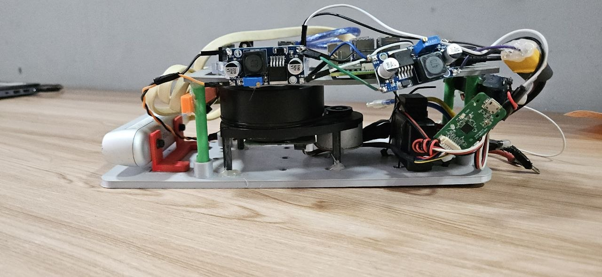
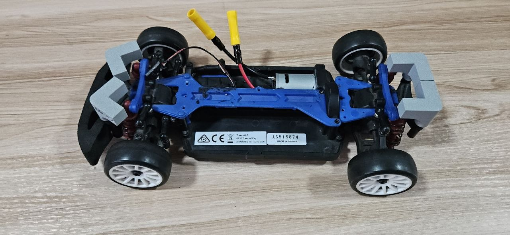
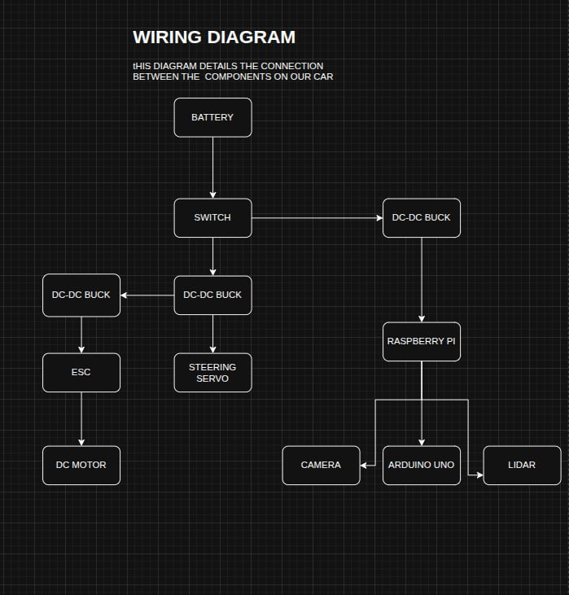
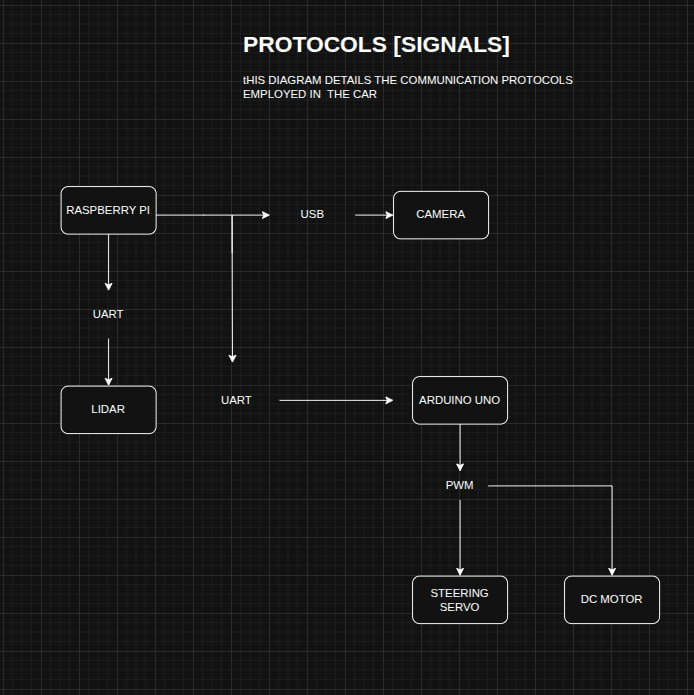

# Hardware Documentation and Setup Guide

## Overview

Our autonomous vehicle is built on a LaTrax Rally RC car chassis, modified with custom electronics and sensors for the WRO Future Engineers competition.

The system integrates:

- Intel RealSense D435i RGB-D Camera
- RPLIDAR A1M8 360° LiDAR
- Raspberry Pi 4B (high-level processing)
- Arduino UNO (low-level motor control)
- 11.1V LiPo battery with regulated power distribution

---

# Hardware Components

| Component | Specifications |
|-----------|----------------|
| Base Chassis | LaTrax Rally RC Car |
| Dimensions (Stock) | 380 × 185 mm |
| Modified Size | Meets WRO competition requirements (300 × 200 × 300 mm maximum) |
| Weight (Stock) | ~430 g |

## Raspberry Pi 4B (Main Computer)

| Specification | Value |
|--------------|-------|
| RAM | 8 GB |
| Operating Voltage | 5V (USB-C) |
| Purpose | High-level computing, vision processing, navigation |

---

## Intel RealSense D435i

| Specification | Value |
|--------------|-------|
| Type | RGB-D Depth Camera with IMU |
| Dimensions | 90 × 25 × 25 mm |
| Power | 5V / 1A (USB) |
| Purpose | Lane detection, obstacle detection, depth estimation |

---

## RPLIDAR A1M8

| Specification | Value |
|--------------|-------|
| Scan Range | Up to 12 m |
| Scan Rate | 8000 samples/sec |
| Rotation Frequency | 5.5 Hz |
| Dimensions | 97 × 70 × 55 mm |
| Power | 5V / 100 mA |
| Purpose | Side wall detection and distance measurement |

---

## Electronic Speed Controller (ESC)

| Specification | Value |
|--------------|-------|
| Model | CL9030 ESC |
| Battery Support | 2S–3S LiPo (7.4V–11.1V) |
| Continuous Current | 90 A |

---

## Steering Servo

| Specification | Value |
|--------------|-------|
| Model | Stock LaTrax Steering Servo |

---

## Power System

| Component | Specification |
|-----------|---------------|
| Main Battery | 11.1V 2200mAh 3S LiPo |
| Voltage Regulation | DC-DC Buck Converter (11.1V → 5V) |

---

## Microcontroller

| Specification | Value |
|--------------|-------|
| Board | Arduino UNO |
| Microcontroller | ATmega328P |
| Operating Voltage | 5V |
| Purpose | Motor and steering control |

---

# Assembly

The stock LaTrax Rally chassis was modified to comply with the WRO Future Engineers regulations and to accommodate all sensors and electronics.

## 1. Size Reduction

- Trimmed body panels to fit within the competition dimensions.
- Final dimensions comply with the 300 × 200 × 300 mm size limit.

---

## 2. Electronics Mounting

- Designed and 3D-printed custom mounting plates for:
  - Raspberry Pi 4B
  - Intel RealSense D435i
  - RPLIDAR A1M8
- Implemented cable management using:
  - Braided cable sleeves
  - Zip ties

---

## 3. Sensor Integration

### Intel RealSense D435i

- Mounted at the front of the vehicle.
- Provides an optimal forward view for:
  - Lane detection
  - Obstacle detection
  - Depth estimation

### RPLIDAR A1M8

- Mounted on the lower deck.
- Used for:
  - Left wall detection
  - Right wall detection
  - Vehicle localization

Sensors were positioned to minimize interference between the camera and LiDAR.

---

## 4. Weight Distribution

To improve stability and handling:

- Battery mounted as low as possible.
- RPLIDAR positioned to maintain balance.
- Left/right weight distribution carefully balanced.
- Center of gravity verified after assembly.

---

# Component Layout

### Assembled Top Layer

---

### Bottom Layer Assembly

---

# Power Distribution

The power system distributes energy from the 3S LiPo battery to all onboard electronics through a regulated power network.

---

# Signal Wiring

The Raspberry Pi communicates with sensors while the Arduino controls the steering servo and ESC.

